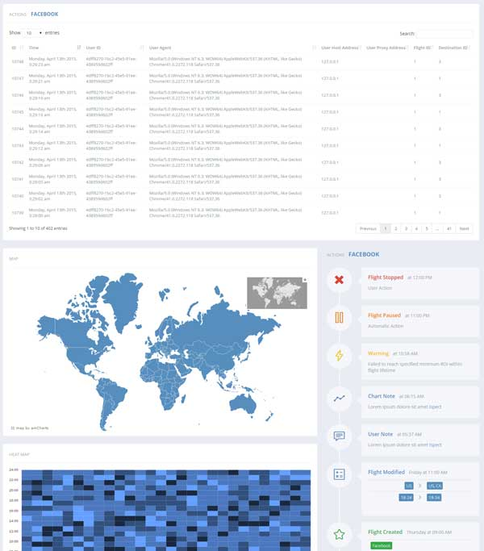
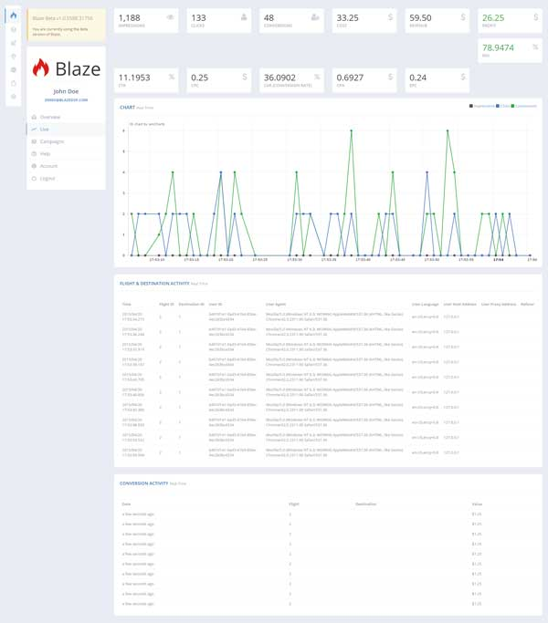

## Blaze DSP

#### About

Blaze DSP is a open source, cloud powered Demand Side Platform.

Blaze DSP has been designed with the priority on low latency, highly scalability and fault tolerance.

This focus allows for server load to be balanced effectively across instances without the loss of critical analytical data in the event of server failures.

It also allows for servers to be located in regions closest to the end use which reduces request time and improves user experience.

Each server is updated in realtime which allows campaign changes to be easily managed without interruption to the end user or loss of revenue for the business.

#### Infrastructure

Blaze DSP use the following technology/frameworks

* Azure Web Apps
* Azure SQL
* Azure Service Bus
* ASP.NET MVC
* ASP.NET Core
* ASP.NET WebAPI2
* EmberJS

#### Screenshots

#### License

MIT License

Copyright (c) 2016 Daniel Franklin

Permission is hereby granted, free of charge, to any person obtaining a copy of this software and associated documentation files (the "Software"), to deal in the Software without restriction, including without limitation the rights to use, copy, modify, merge, publish, distribute, sublicense, and/or sell copies of the Software, and to permit persons to whom the Software is furnished to do so, subject to the following conditions:

The above copyright notice and this permission notice shall be included in all copies or substantial portions of the Software.

THE SOFTWARE IS PROVIDED "AS IS", WITHOUT WARRANTY OF ANY KIND, EXPRESS OR IMPLIED, INCLUDING BUT NOT LIMITED TO THE WARRANTIES OF MERCHANTABILITY, FITNESS FOR A PARTICULAR PURPOSE AND NONINFRINGEMENT. IN NO EVENT SHALL THE AUTHORS OR COPYRIGHT HOLDERS BE LIABLE FOR ANY CLAIM, DAMAGES OR OTHER LIABILITY, WHETHER IN AN ACTION OF CONTRACT, TORT OR OTHERWISE, ARISING FROM, OUT OF OR IN CONNECTION WITH THE SOFTWARE OR THE USE OR OTHER DEALINGS IN THE SOFTWARE.